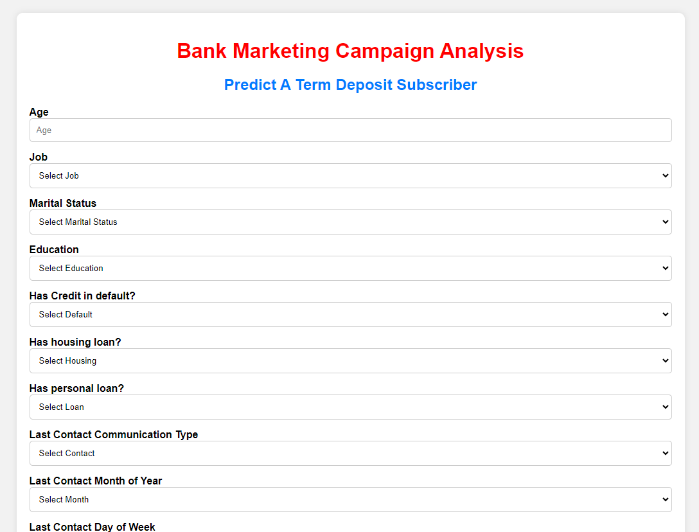
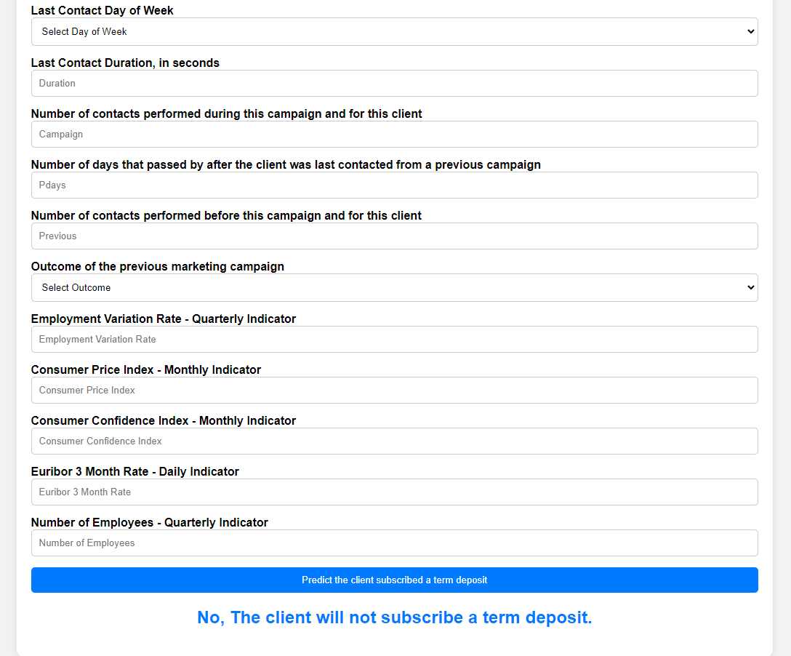

# End-to-End Bank Marketing Campaign Machine Learning Project

## Overview
This project aims to predict whether clients will subscribe to a term deposit in a bank marketing campaign. It utilizes machine learning techniques on a dataset containing various client attributes, previous campaign history, and economic indicators.

## Features
- Age
- Job
- Marital status
- Education level
- Credit default status
- Housing loan status
- Personal loan status
- Contact communication type
- Last contact month of the year
- Last contact day of the week
- Last contact duration (seconds)
- Number of contacts performed during this campaign
- Number of days since the client was last contacted
- Number of contacts performed before this campaign
- Outcome of the previous marketing campaign
- Economic indicators: employment variation rate, consumer price index, consumer confidence index, euribor 3 month rate, number of employees

## Project Structure
- `notebooks/`: Contains Jupyter notebooks for exploratory data analysis (EDA), data cleaning, and model training.
- `src/`: Contains modular code for data ingestion, transformation, and model training.
- `app`: Flask web application for interacting with the trained model.
- `Dockerfile`: Defines Docker image configuration for containerization.
- `requirements.txt`: Lists dependencies required for the project.
- `README.md`: Overview and instructions for running the project.

## Usage
1. Clone the repository.
2. Navigate to the project directory.
3. Install dependencies: `pip install -r requirements.txt`.
4. Run the Flask web application: `python app.py`.
5. Access the web application in your browser.

## Deployment
- Dockerize the project: `docker build -t bank-marketing-prediction .`.
- Run the Docker container: `docker run -p 8080:8080 bank-marketing-prediction`.
- Access the Flask web application at `http://localhost:8080`.

## Contributor
- [Vikas Chauhan](https://github.com/vikaschauhan734)

## Acknowledgements
- Dataset Source: [Bank Marketing Campaign Dataset](https://www.kaggle.com/datasets/muhammedabdelrasoul/bank-marketing/data)

## Images

